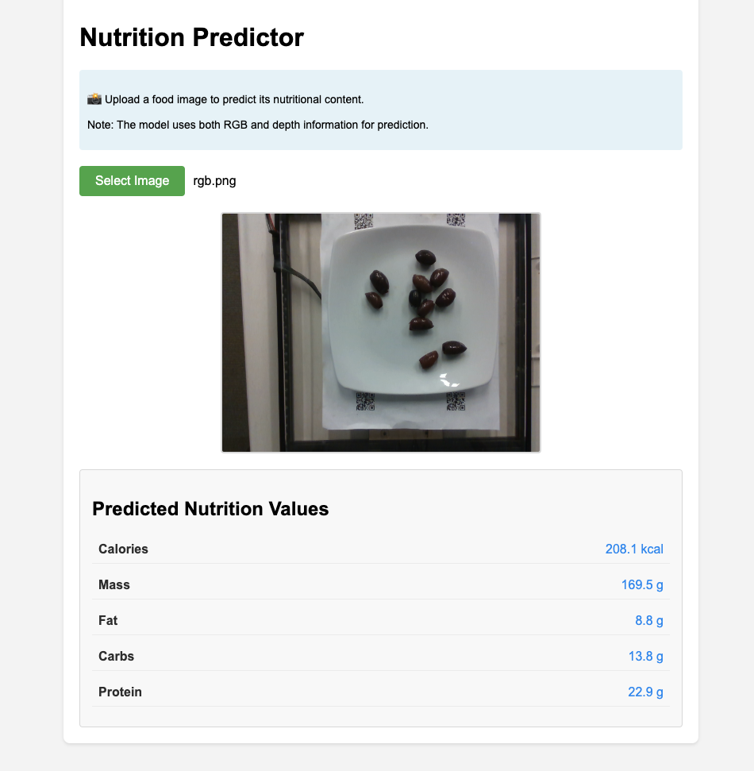

# Nutrition5K Project

## Overview
This project implements and extends the Nutrition5K paper to predict nutritional content from food images. The model takes both RGB images and depth information as input to predict calories, mass, and macronutrient content (fat, carbohydrates, protein).

## Web Interface Demo

<p align="center">
  
  <br>
  <em>Web interface showing real-time nutrition prediction from food images</em>
</p>

## Features
- Dual input processing (RGB + depth information)
- Real-time prediction of:
  - Calories (kcal)
  - Mass (g)
  - Fat (g)
  - Carbohydrates (g)
  - Protein (g)
- User-friendly web interface
- Instant results display

## Model Architecture
The model uses a modified InceptionV3 architecture with:
- 6-channel input (RGB + depth)
- Multi-task prediction heads
- Shared feature extractor

## Installation

### Requirements
```bash
# Python packages
pip install torch torchvision
pip install numpy pandas
pip install flask flask-cors
pip install ngrok-api pyngrok
pip install Pillow tqdm
```

### Setup
1. Clone the repository:
```bash
git clone [your-repo-url]
cd nutrition5k-project
```

2. Install dependencies:
```bash
pip install -r requirements.txt
```

## Usage

### Local Deployment
1. Start the server:
```python
python app.py
```

2. Access the web interface at `http://localhost:5000`

### Cloud Deployment (using ngrok)
1. Get your ngrok auth token from https://dashboard.ngrok.com/signup
2. Run the server with ngrok:
```python
python app.py --ngrok-token YOUR_TOKEN
```

## Evaluation Results

| Metric    | MAE    | MAE%   | Paper MAE% |
|-----------|--------|--------|------------|
| Calories  | [Value]| [Value]| 26.1%      |
| Mass      | [Value]| [Value]| 18.8%      |
| Fat       | [Value]| [Value]| 34.2%      |
| Carbs     | [Value]| [Value]| 31.9%      |
| Protein   | [Value]| [Value]| 29.5%      |

## Project Structure
```
nutrition5k-project/
├── assets/              # Images and resources
│   └── interface_demo.png
├── models/             # Model architecture
├── utils/             # Helper functions
├── app.py            # Flask application
└── requirements.txt  # Dependencies
```

## Citation
```bibtex
@article{nutrition5k2021,
  title={Nutrition5k: Towards Automatic Nutritional Understanding of Generic Food},
  author={Thames, Quin and Karpur, Arjun and Norris, Wade and Xia, Fangting and Panait, Liviu and Weyand, Tobias and Sim, Jack},
  journal={arXiv preprint arXiv:2103.03375},
  year={2021}
}
```

## License
[Your License]

## Setup Instructions to Add Interface Screenshot:

1. Create assets directory:
```bash
mkdir -p assets
```

2. Save interface screenshot:
- Name: `interface_demo.png`
- Location: `./assets/interface_demo.png`
- Size: Optimized for web (< 1MB)

3. Add to README:
```markdown
<p align="center">
  
</p>
```

## Acknowledgments
- Original Nutrition5K paper authors


## Contact
[gao2@uchicago.edu]
